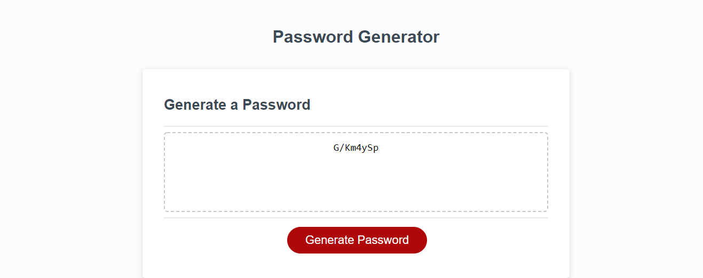

# Password generator

## Purpose

To build a javascript password generator when given a simple HTML interface

This website takes in user input, verifies their entrees, and displays a password from 8 to 128 characters, using only the specific characters indicated by the user

## Built with

- HTML
- CSS
- Javascript

## Website

https://quasse.github.io/password/

## Screenshot

## Contribution

Made by Sam Morgen
